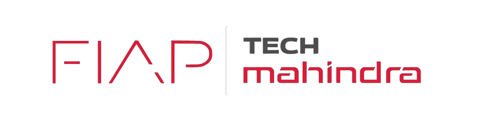

# Projeto Fiap-TechMahindra - Sprint 2

## O Projeto
Fórmula E 
Desenvolvemos atráves de IOT um sistema capaz de aumentar a interação dos espectadores com as corridas, onde o usuario podera mudar a cor do led dá sua pulseira interativa, todos as pessoas nas arquibancadas receberam um puleira rgb. Que poderá ser vista através das transmissões de forma muito interativa.

Vídeo de exibição: [https://youtu.be/nFej_gE7RgE?si=FXJV2U1PnVG6fqxp](https://youtu.be/2j3WFnkAS-k)

## Funcionalidades

- Possibilidade de modificar a cor do LED da pulseira pelo site
- Organização de movimento nos leds

## Membros do Grupo

Este projeto é desenvolvido pela Virtual Vanguard:

- Leonardo Correa de Mello - RM555573 - ([linkedin](https://www.linkedin.com/in/leocorreamello/))
- Gabriel Alves Machado Vara - RM555355 - ([linkedin](https://www.linkedin.com/in/gabriel-vara/))
- Luiza Macena Dantas - RM5562537 - ([linkedin](https://www.linkedin.com/in/luiza-macena-2a6715283/))
- Eduardo Fakiani - 556093 - ([linkedin](https://www.linkedin.com/in/eduardo-fakiani/))
- Fernanda Rocha Menon - 554673 - ([linkedin](https://www.linkedin.com/in/fernanda-rocha-menon-/))
